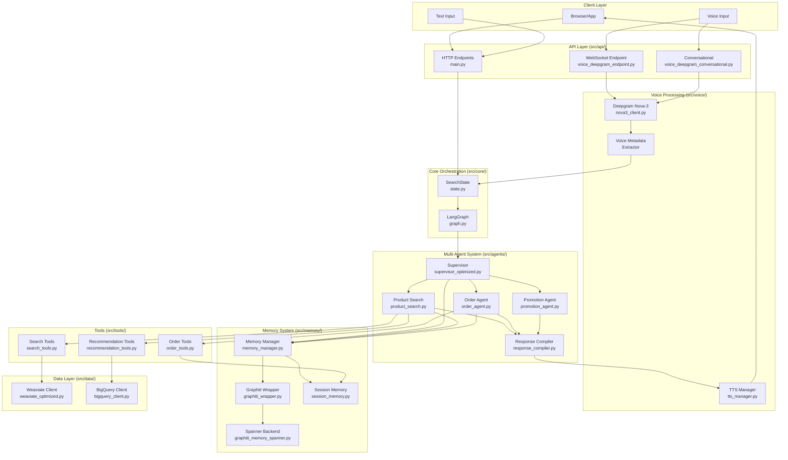
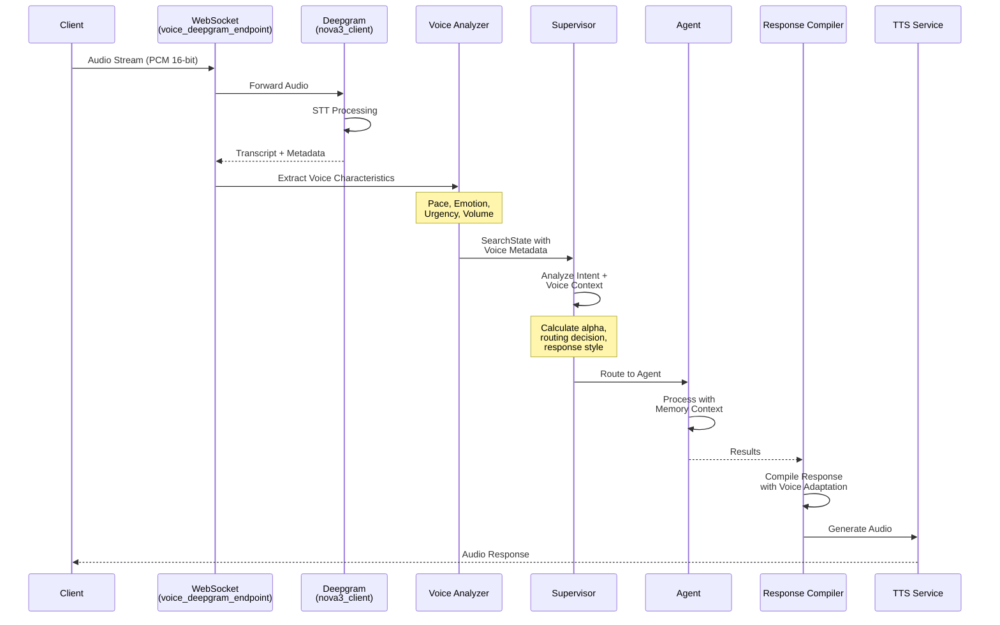
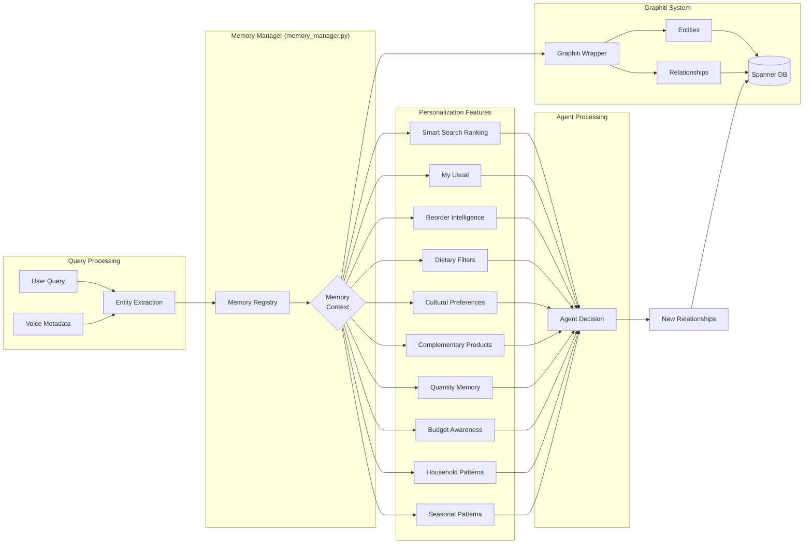
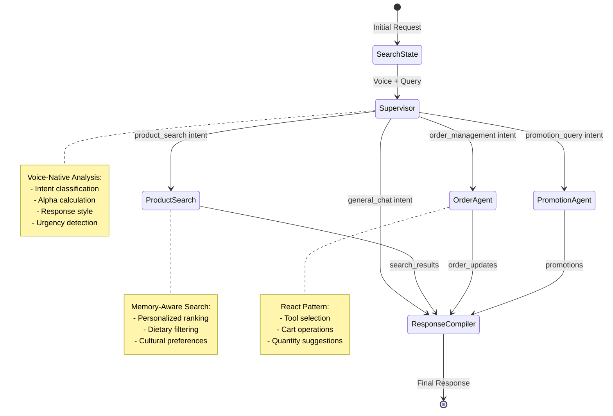
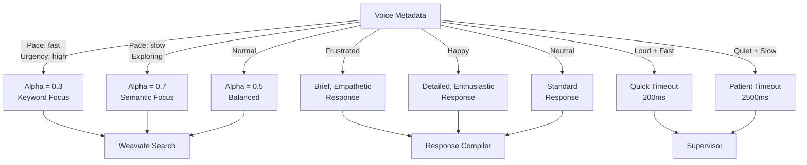
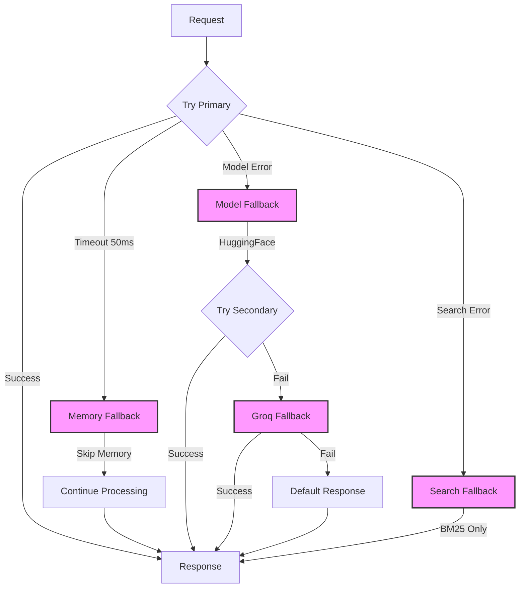

# LeafLoaf Codebase Flow Diagrams 🔄

## 1. Complete System Architecture



## 2. Voice Processing Pipeline



## 3. Memory Integration Flow



## 4. Agent Communication Pattern



## 5. Data Flow Through Key Files

```
1. ENTRY POINTS
   ├── run.py → FastAPI server startup
   ├── src/api/main.py → Route configuration
   └── src/api/voice_deepgram_endpoint.py → WebSocket handler

2. VOICE PROCESSING
   ├── src/voice/deepgram/nova3_client.py → STT streaming
   ├── src/voice/processors/transcript_processor.py → Analysis
   └── src/voice/synthesis/tts_manager.py → Speech synthesis

3. ORCHESTRATION
   ├── src/core/graph.py → LangGraph workflow
   ├── src/models/state.py → State definitions
   └── src/core/state_manager.py → State persistence

4. AGENT EXECUTION
   ├── src/agents/memory_aware_base.py → Base class
   ├── src/agents/supervisor_optimized.py → Routing
   ├── src/agents/product_search.py → Search execution
   └── src/agents/response_compiler.py → Response formatting

5. MEMORY OPERATIONS
   ├── src/memory/memory_manager.py → Unified interface
   ├── src/memory/graphiti_wrapper.py → Graphiti ops
   └── src/memory/graphiti_memory_spanner.py → Storage

6. DATA ACCESS
   ├── src/data/weaviate_optimized.py → Vector search
   ├── src/analytics/bigquery_client.py → Analytics
   └── src/utils/redis_manager.py → Session cache
```

## 6. Voice Metadata Influence



## 7. Error Handling & Fallback Chain



## 8. Performance Optimization Points

```
PARALLELIZATION POINTS:
├── Memory fetch + LLM analysis (parallel)
├── Multiple tool calls (concurrent execution)
├── BigQuery streaming (fire-and-forget)
└── Connection pooling (Weaviate)

CACHING LAYERS:
├── In-memory session state
├── Redis cache (when enabled)
├── Connection pool reuse
└── Model instance caching

TIMEOUT STRATEGY:
├── Memory: 50-100ms
├── LLM: 200-2500ms (environment-aware)
├── Search: 300-400ms
└── Total voice: <2s target
```

## Key Code Paths

### Voice Request (Most Common)
1. `voice_deepgram_endpoint.py` → WebSocket connection
2. `nova3_client.py` → Audio processing
3. `supervisor_optimized.py` → Intent analysis
4. `product_search.py` → Product search
5. `response_compiler.py` → Format response
6. Return to client

### Cart Operation
1. `voice_deepgram_endpoint.py` → WebSocket
2. `supervisor_optimized.py` → Route to order
3. `order_agent.py` → Tool selection
4. `order_tools.py` → Cart operation
5. `session_memory.py` → Update cart
6. `response_compiler.py` → Confirm

### Memory Learning
1. User interaction → Entity extraction
2. `graphiti_wrapper.py` → Process entities
3. `graphiti_memory_spanner.py` → Store relationships
4. Future queries → Retrieve context
5. Apply personalization

This comprehensive flow diagram shows how all components in the LeafLoaf codebase work together to provide a voice-native, personalized grocery shopping experience.