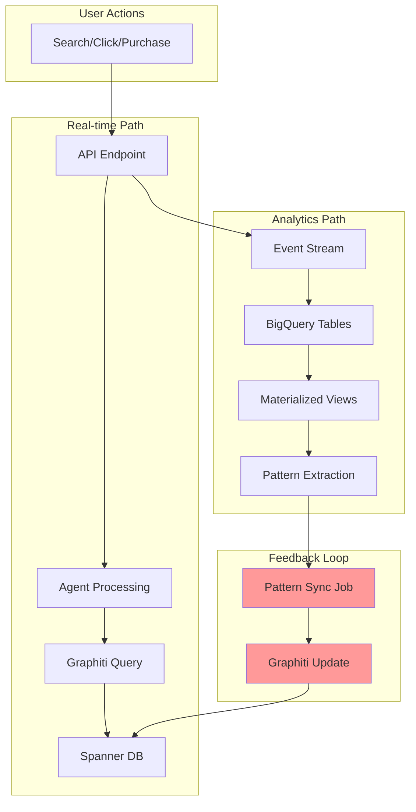

# Graphiti Complete Architecture - LeafLoaf

## 🎯 Executive Summary

Graphiti is our graph-based memory system that powers personalization across LeafLoaf. This document covers the complete architecture including the critical feedback loop between BigQuery (analytics) and Spanner/Graphiti (real-time).

## 📊 Current State vs Target State

### Current State (Partial Implementation)
- ✅ Graphiti nodes/edges in Spanner
- ✅ Memory-aware agents reading from Graphiti
- ✅ BigQuery event streaming
- ❌ No feedback loop from BigQuery to Graphiti
- ❌ Learning methods are stubs
- ❌ Pattern extraction not implemented

### Target State (Complete Implementation)
- ✅ Bidirectional data flow
- ✅ Automated pattern extraction
- ✅ Continuous learning
- ✅ Hybrid storage strategy
- ✅ <300ms response times

## 🏗️ Complete Architecture

### 1. Data Flow Layers

```
┌─────────────────────────────────────────────────────────────┐
│                        USER LAYER                           │
│  Web App    Mobile App    Voice Assistant    API Clients   │
└─────────────────┬───────────────────────────────────────────┘
                  │
┌─────────────────▼───────────────────────────────────────────┐
│                        API LAYER                            │
│  /search    /cart    /track    /preferences    /dashboard  │
└─────────────────┬───────────────────────────────────────────┘
                  │
┌─────────────────▼───────────────────────────────────────────┐
│                     AGENT LAYER                             │
│  Supervisor → Search Agent → Order Agent → Response Compiler│
│         ↓           ↓            ↓              ↓           │
│  [Memory-Aware Base Agent with Graphiti Context]           │
└─────────────────┬───────────────────────────────────────────┘
                  │
        ┌─────────┴─────────┐
        │                   │
┌───────▼────────┐ ┌────────▼────────┐
│  REAL-TIME     │ │   ANALYTICS     │
│  Spanner       │ │   BigQuery      │
│  - Graphiti    │ │   - Events      │
│  - Sessions    │ │   - ML Views    │
│  - Orders      │ │   - Patterns    │
└───────┬────────┘ └────────┬────────┘
        │                   │
        └─────────┬─────────┘
                  │
         FEEDBACK LOOP
         Pattern Sync Jobs
```

### 2. Complete Data Flow with Feedback Loop



## 🔄 The Critical Feedback Loop

### Why It's Essential
Without the feedback loop:
- BigQuery computes patterns that never help users
- Agents can't learn from historical data
- No improvement over time
- Wasted computational resources

### Implementation Strategy

#### Phase 1: Pattern Extraction (BigQuery → Patterns)
```sql
-- Extract stable patterns from BigQuery
CREATE OR REPLACE PROCEDURE `leafloaf_analytics.extract_user_patterns`()
BEGIN
  -- Brand preferences
  INSERT INTO pattern_extraction_queue
  SELECT 
    'PREFERS' as pattern_type,
    user_id,
    brand as target,
    confidence_score,
    CURRENT_TIMESTAMP() as extracted_at
  FROM user_brand_affinity_mv
  WHERE confidence_score > 0.8
  AND days_stable > 7;
  
  -- Reorder patterns
  INSERT INTO pattern_extraction_queue
  SELECT 
    'REORDERS_EVERY' as pattern_type,
    user_id,
    product_sku as target,
    JSON_OBJECT(
      'days', avg_reorder_days,
      'quantity', usual_quantity
    ) as metadata,
    reorder_confidence as confidence_score,
    CURRENT_TIMESTAMP() as extracted_at
  FROM reorder_intelligence_mv
  WHERE reorder_confidence > 0.7;
END;
```

#### Phase 2: Pattern Synchronization (Patterns → Graphiti)
```python
class PatternSynchronizer:
    """Syncs learned patterns back to Graphiti"""
    
    async def sync_patterns(self):
        # 1. Read from extraction queue
        patterns = await self.bigquery.read_extraction_queue()
        
        # 2. Batch update Graphiti
        for batch in self.batch_patterns(patterns, size=1000):
            await self.update_graphiti_batch(batch)
        
        # 3. Mark as processed
        await self.bigquery.mark_patterns_processed(patterns)
    
    async def update_graphiti_batch(self, patterns):
        """Efficient batch update to Spanner"""
        mutations = []
        
        for pattern in patterns:
            if pattern['pattern_type'] == 'PREFERS':
                mutations.append(self.create_preference_mutation(pattern))
            elif pattern['pattern_type'] == 'REORDERS_EVERY':
                mutations.append(self.create_reorder_mutation(pattern))
        
        await self.spanner.batch_write(mutations)
```

## 🎯 Hybrid Storage Strategy

### Decision Matrix: What Goes Where?

| Data Type | Spanner/Graphiti | BigQuery | Cache | Why |
|-----------|------------------|----------|--------|-----|
| User preferences (top 5 brands) | ✅ | ✅ | ✅ | High-frequency access |
| Dietary restrictions | ✅ | ✅ | ✅ | Critical for filtering |
| Reorder cycles | ✅ | ✅ | ❌ | Stable, important |
| Recent interactions (24h) | ✅ | ✅ | ✅ | Real-time context |
| Purchase history (full) | ❌ | ✅ | ❌ | Too large for Spanner |
| Trending products | ❌ | ✅ | ✅ | Changes hourly |
| Seasonal patterns | ❌ | ✅ | ✅ | Analytics only |
| Co-purchase (top 5) | ✅ | ✅ | ✅ | Frequently accessed |
| Co-purchase (all) | ❌ | ✅ | ❌ | Long tail in BigQuery |
| ML predictions | ❌ | ✅ | ✅ | Computed in BigQuery |

### Synchronization Rules

```python
SYNC_RULES = {
    'user_preferences': {
        'condition': 'confidence > 0.8 AND interaction_count > 5',
        'frequency': 'daily',
        'limit': 'top 10 per user'
    },
    'dietary_restrictions': {
        'condition': 'confidence > 0.9',
        'frequency': 'on_change',
        'limit': 'all'
    },
    'reorder_patterns': {
        'condition': 'purchases > 3 AND confidence > 0.7',
        'frequency': '6_hours',
        'limit': 'all'
    },
    'co_purchase': {
        'condition': 'co_occurrence > 10 AND confidence > 0.6',
        'frequency': 'daily',
        'limit': 'top 5 per product'
    }
}
```

## 🚀 Implementation Roadmap

### Week 1: Complete Learning Methods
- [ ] Implement `_store_interaction()` in memory_aware_base.py
- [ ] Implement `_update_success_patterns()`
- [ ] Implement `_update_failure_patterns()`
- [ ] Add pattern extraction methods to GraphitiWrapper

### Week 2: Build Feedback Loop
- [ ] Create BigQuery stored procedures for pattern extraction
- [ ] Build PatternSynchronizer service
- [ ] Set up Cloud Scheduler jobs
- [ ] Implement batch mutations for Spanner

### Week 3: Agent Integration
- [ ] Update agents to use synchronized patterns
- [ ] Add pattern explanation capability
- [ ] Implement confidence-based routing
- [ ] Add pattern versioning

### Week 4: Optimization & Monitoring
- [ ] Add performance metrics
- [ ] Implement smart caching
- [ ] Set up alerting for sync failures
- [ ] Create pattern quality metrics

## 📈 Performance Targets

### Latency Breakdown
```
Total Response: <300ms
├── API overhead: 20ms
├── Agent processing: 50ms
├── Graphiti query: 50ms
├── BigQuery query (cached): 20ms
├── Weaviate search: 100ms
├── Response compilation: 40ms
└── Buffer: 20ms
```

### Optimization Strategies
1. **Parallel Queries**: Fetch from Graphiti + BigQuery simultaneously
2. **Smart Caching**: Cache BigQuery results for 1 hour
3. **Batch Updates**: Sync patterns in batches of 1000
4. **Selective Sync**: Only sync high-confidence patterns
5. **Timeout Management**: Fail fast on slow queries

## 🔍 Pattern Quality Metrics

```python
class PatternQualityMonitor:
    """Ensures only high-quality patterns are synced"""
    
    QUALITY_THRESHOLDS = {
        'min_confidence': 0.7,
        'min_interactions': 5,
        'max_variance': 0.2,
        'min_recency_days': 90
    }
    
    async def evaluate_pattern_quality(self, pattern):
        """Determine if pattern should be synced"""
        
        quality_score = (
            pattern['confidence'] * 0.4 +
            pattern['stability'] * 0.3 +
            pattern['recency'] * 0.2 +
            pattern['frequency'] * 0.1
        )
        
        return quality_score > 0.75
```

## 🎯 Next Steps for Brainstorming

### Key Decisions Needed:
1. **Sync Frequency**: Real-time vs Batch?
2. **Pattern Priority**: Which patterns are most valuable?
3. **Storage Limits**: How many patterns per user in Spanner?
4. **Conflict Resolution**: BigQuery pattern vs real-time signal?
5. **Privacy Controls**: How do users manage their patterns?

### Architecture Variations to Consider:
1. **Option A**: Sync everything to Graphiti (simple but expensive)
2. **Option B**: Keep analytics in BigQuery, query both (complex but flexible)
3. **Option C**: Smart hybrid based on pattern characteristics (recommended)

### Cost Considerations:
- Spanner: $0.90/hour per node + storage
- BigQuery: $5/TB scanned + storage
- Trade-off: More in Spanner = faster but costlier

## 📝 Implementation Checklist

- [ ] Complete memory_aware_base.py methods
- [ ] Build pattern extraction pipeline
- [ ] Create sync job infrastructure
- [ ] Update agents to use patterns
- [ ] Add monitoring and metrics
- [ ] Implement privacy controls
- [ ] Create pattern explanation API
- [ ] Build admin dashboard
- [ ] Write integration tests
- [ ] Document pattern lifecycle

## 🔗 Related Documentation
- [GRAPHITI_3D_VISUALIZATION.md](./GRAPHITI_3D_VISUALIZATION.md) - Visual architecture
- [API_ENDPOINT_CONTRACTS.md](./API_ENDPOINT_CONTRACTS.md) - API specifications
- [PERSONALIZATION_IMPLEMENTATION.md](./docs/PERSONALIZATION_IMPLEMENTATION.md) - Feature details