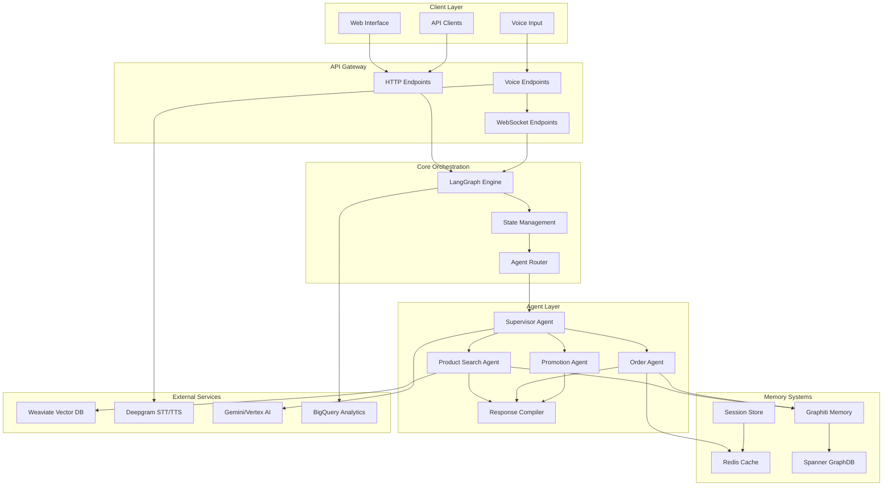
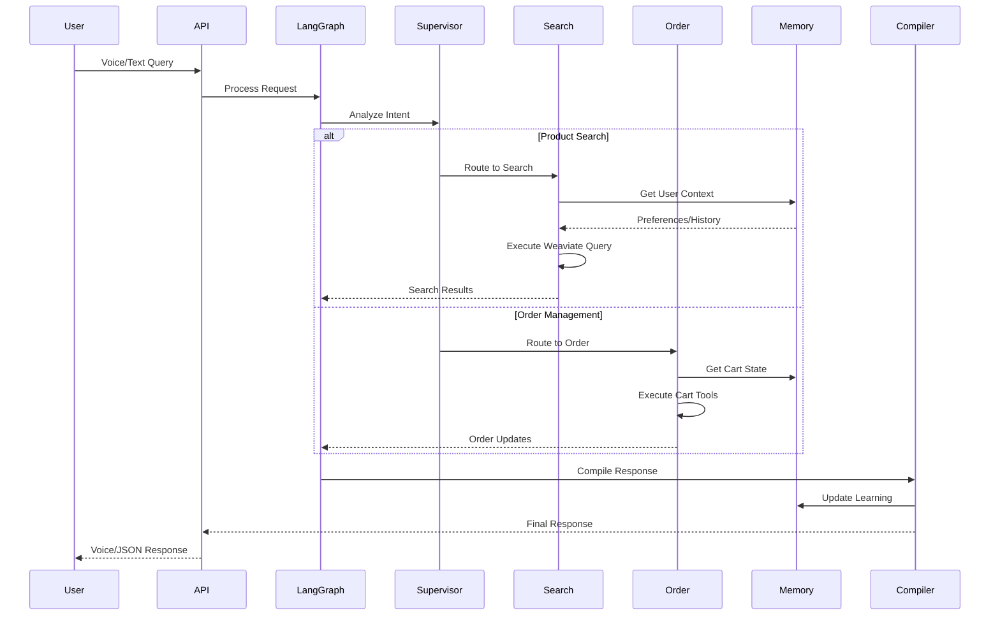
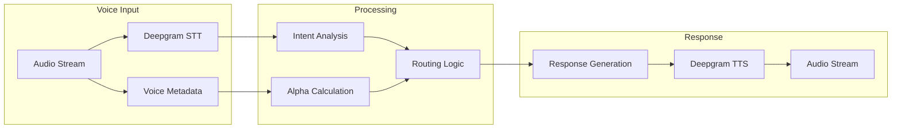
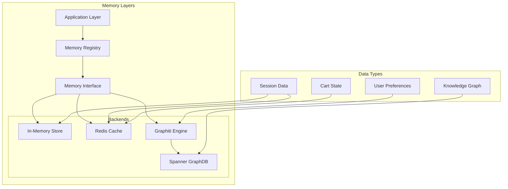
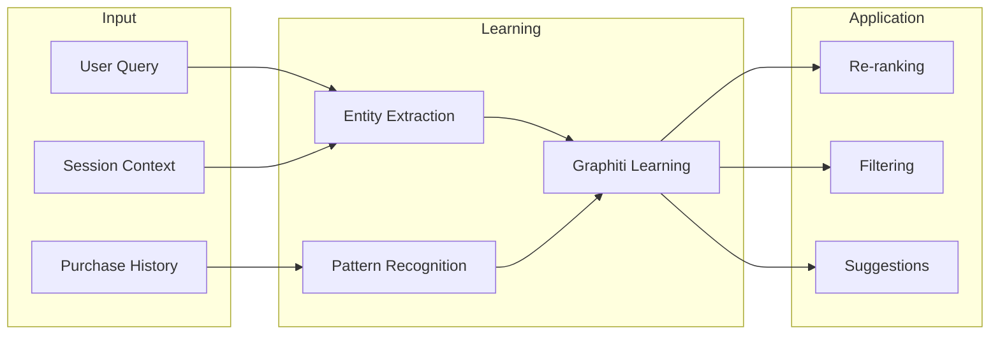
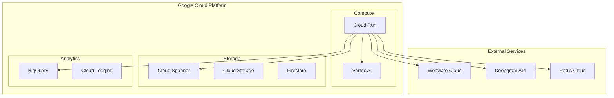
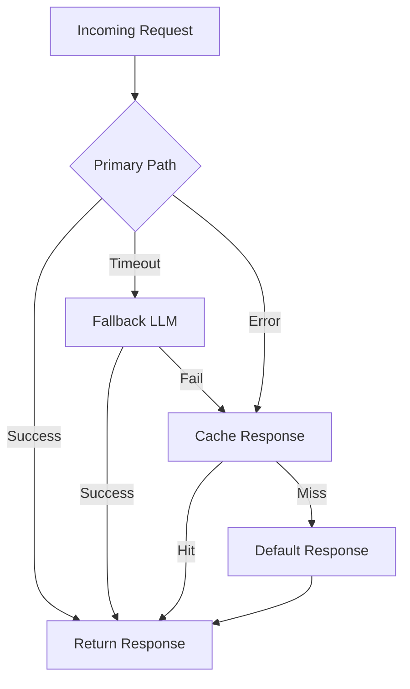

# LeafLoaf Architecture Visual Map

## System Overview Diagram

## Agent Communication Flow

## Voice Processing Pipeline

## Memory Architecture

## Personalization Flow

## Deployment Architecture

## Error Handling & Fallbacks

## Key Integration Points

### 1. **Voice Integration**
- Multiple Deepgram clients for different use cases
- Voice metadata influences search parameters
- Real-time STT/TTS with WebSocket support

### 2. **Memory Integration**
- All agents inherit from MemoryAwareAgent
- Graphiti provides self-learning capabilities
- Multiple backend support (Redis, Spanner, In-memory)

### 3. **Search Integration**
- Weaviate hybrid search with dynamic alpha
- Voice-driven search parameter adjustment
- Personalization through re-ranking

### 4. **Analytics Integration**
- Fire-and-forget BigQuery streaming
- Real-time event capture
- ML feature generation

### 5. **LLM Integration**
- Environment-aware model selection
- Automatic fallback mechanisms
- Multiple provider support (Gemini, Vertex AI, HuggingFace)

## Performance Optimization Points

1. **Caching Strategy**
   - Redis for session data
   - Search result caching
   - LLM response caching

2. **Parallel Execution**
   - Agent parallelization in graph_v2
   - Async operations throughout
   - Non-blocking analytics

3. **Connection Pooling**
   - Database connection reuse
   - API client pooling
   - WebSocket connection management

4. **Resource Management**
   - Per-request agent instances
   - Memory cleanup
   - Timeout management

This visual map provides a comprehensive overview of how all components in the LeafLoaf system interconnect and work together to provide a seamless, voice-native grocery shopping experience.