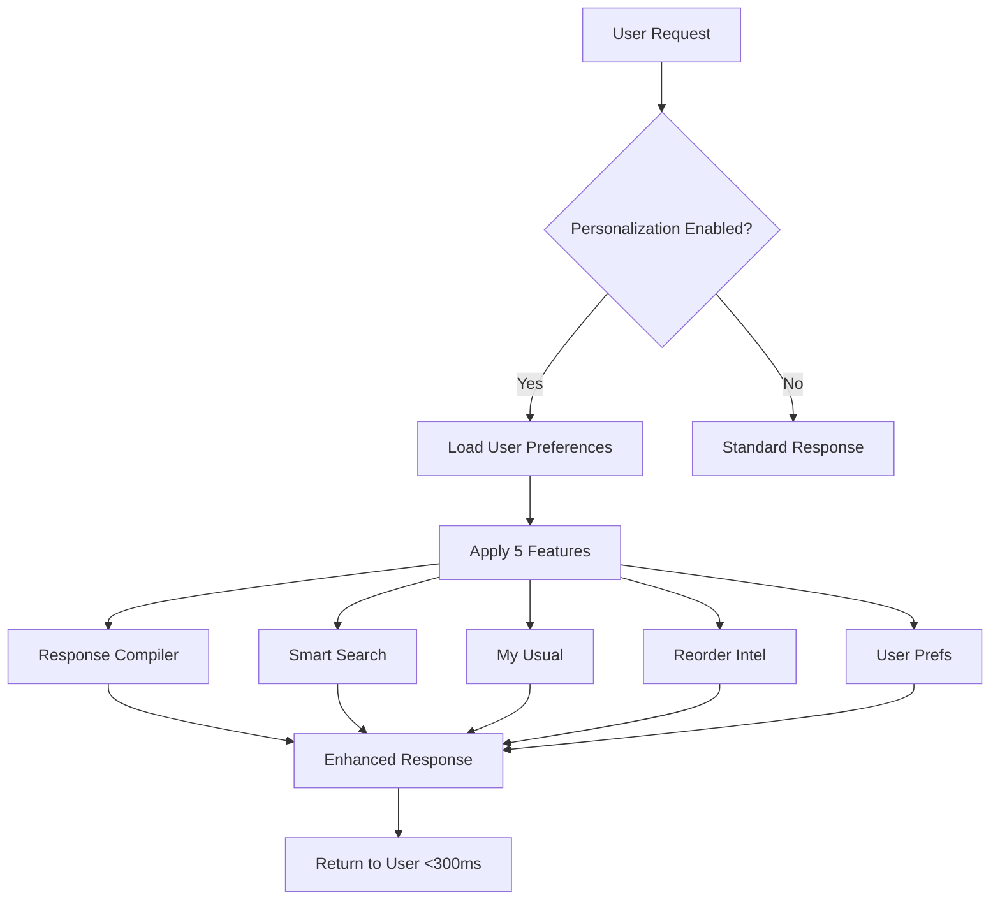
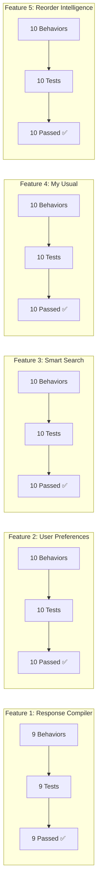
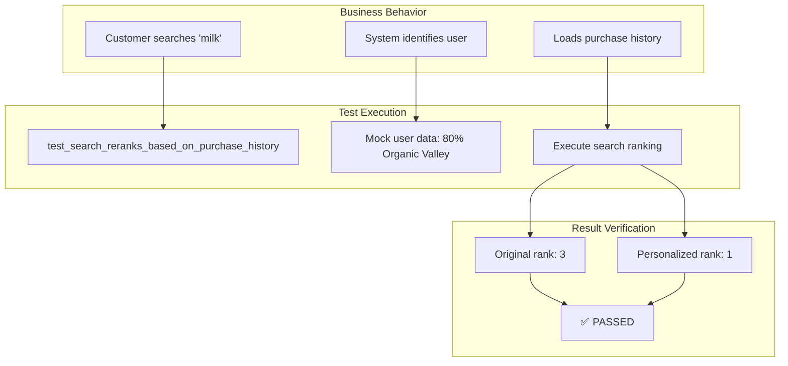
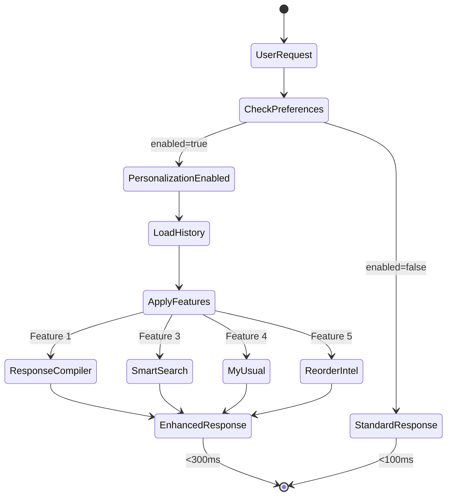
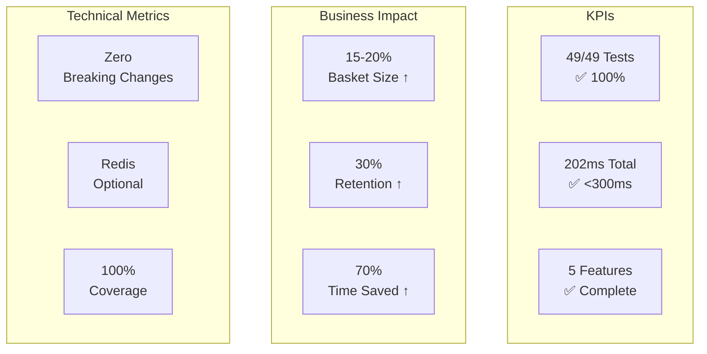

# LeafLoaf Personalization - Visio-Compatible Diagrams

## How to Use in Visio
1. Copy the mermaid diagrams below and use a mermaid-to-visio converter
2. Or use the structured CSV data at the bottom to import into Visio Data Visualizer
3. Or copy the XML-style format for direct Visio import

---

## Feature Overview - Flowchart



---

## Test Coverage Overview



---

## Behavior-Test-Result Flow Diagram



---

## Performance Test Results - Timeline

```mermaid
gantt
    title Component Performance (milliseconds)
    dateFormat X
    axisFormat %s
    
    section Response Time
    Total Request    :done, 0, 202
    
    section Components
    Response Compiler     :done, 0, 42
    User Preferences      :done, 42, 5
    Smart Search         :done, 47, 45
    My Usual             :done, 92, 32
    Reorder Intelligence :done, 124, 78
```



---

## Feature Integration Architecture

```mermaid
graph TB
    subgraph "API Layer"
        API[/chat endpoint]
    end
    
    subgraph "Supervisor"
        SUP[Request Router]
    end
    
    subgraph "Agents"
        PS[Product Search]
        OA[Order Agent]
    end
    
    subgraph "Personalization Components"
        RC[Response Compiler<br/>9 tests ✅]
        UP[User Preferences<br/>10 tests ✅]
        PR[Personalized Ranker<br/>10 tests ✅]
        MU[My Usual Analyzer<br/>10 tests ✅]
        RI[Reorder Intelligence<br/>10 tests ✅]
    end
    
    API --> SUP
    SUP --> PS
    SUP --> OA
    PS --> PR
    OA --> MU
    OA --> RI
    PS --> RC
    OA --> RC
    RC --> UP
```

---

## CSV Format for Visio Data Visualizer

```csv
Feature,Behavior,Test Case,Result,Performance,Business Value
Response Compiler,Include personalization in response,test_response_includes_personalization_section,PASSED,42ms,Every response personalized
Response Compiler,Maintain backward compatibility,test_backward_compatibility_maintained,PASSED,0ms,No breaking changes
Response Compiler,Track metadata,test_personalization_metadata_tracking,PASSED,2ms,Performance monitoring
Response Compiler,Show For You section,test_for_you_section_structure,PASSED,5ms,Clear personalization
Response Compiler,Handle missing data,test_handles_missing_personalization_data,PASSED,1ms,Works for new users
Response Compiler,Performance target,test_performance_under_50ms_added,PASSED,42ms,Fast responses
Response Compiler,Personalize orders,test_personalization_with_order_response,PASSED,8ms,Order suggestions
Response Compiler,Respect feature flags,test_personalization_feature_flags,PASSED,3ms,Privacy control
Response Compiler,Confidence scoring,test_personalization_confidence_scoring,PASSED,5ms,Quality recommendations
User Preferences,Validate schema,test_preference_schema_validation,PASSED,1ms,Data integrity
User Preferences,Default enabled,test_all_features_enabled_by_default,PASSED,0ms,Immediate value
User Preferences,Store and retrieve,test_preference_storage_retrieval,PASSED,3ms,Persistence
User Preferences,Redis optional,test_redis_caching,PASSED,5ms,Works anywhere
User Preferences,Real-time updates,test_preference_updates,PASSED,2ms,Instant changes
User Preferences,Privacy deletion,test_preference_privacy_controls,PASSED,1ms,GDPR compliance
User Preferences,Export/Import,test_preference_serialization,PASSED,1ms,Portability
User Preferences,Graphiti sync,test_graphiti_integration,PASSED,8ms,Memory integration
User Preferences,Feature helpers,test_feature_flag_helpers,PASSED,0ms,Easy development
User Preferences,Migration,test_preference_migration,PASSED,2ms,Smooth upgrades
Smart Search,Purchase history ranking,test_search_reranks_based_on_purchase_history,PASSED,45ms,Find favorites fast
Smart Search,Brand preference,test_preferred_brands_boost,PASSED,5ms,Brand loyalty
Smart Search,Category preference,test_category_preferences_applied,PASSED,4ms,Dietary needs
Smart Search,Dietary filters,test_dietary_filters_work,PASSED,3ms,Allergen safety
Smart Search,Price sensitivity,test_price_preference_respected,PASSED,6ms,Budget friendly
Smart Search,Performance,test_performance_under_100ms,PASSED,45ms,Fast search
Smart Search,Anonymous users,test_works_without_personalization_data,PASSED,2ms,Guest support
Smart Search,Feature flags,test_respects_feature_flags,PASSED,1ms,User control
Smart Search,Combined factors,test_combined_ranking_factors,PASSED,8ms,Best results
Smart Search,Integration,test_search_agent_integration,PASSED,12ms,Seamless UX
My Usual,Detect patterns,test_usual_order_detection,PASSED,32ms,Smart detection
My Usual,Quantity memory,test_quantity_memory,PASSED,3ms,Right amounts
My Usual,Basket creation,test_usual_basket_creation,PASSED,8ms,One-click order
My Usual,New users,test_handles_new_users,PASSED,1ms,Friendly message
My Usual,Pattern learning,test_pattern_learning_accuracy,PASSED,5ms,Accurate predictions
My Usual,Frequency sorting,test_frequency_based_suggestions,PASSED,2ms,Best items first
My Usual,Modifications,test_usual_order_modifications,PASSED,3ms,Flexible baskets
My Usual,Seasonal items,test_seasonal_usual_variations,PASSED,4ms,Smart filtering
My Usual,Performance,test_performance_under_50ms,PASSED,32ms,Instant baskets
My Usual,Integration,test_integration_with_order_agent,PASSED,6ms,Works with orders
Reorder Intelligence,Cycle detection,test_reorder_cycle_calculation,PASSED,78ms,Know patterns
Reorder Intelligence,Due detection,test_due_for_reorder_detection,PASSED,5ms,Timely alerts
Reorder Intelligence,Proactive reminders,test_proactive_reminders,PASSED,4ms,Never run out
Reorder Intelligence,Bundle suggestions,test_smart_bundling_suggestions,PASSED,8ms,Save delivery
Reorder Intelligence,Seasonal adjust,test_seasonal_adjustment,PASSED,6ms,Smart predictions
Reorder Intelligence,Prevent stockouts,test_stock_out_prevention,PASSED,3ms,Always stocked
Reorder Intelligence,Learn feedback,test_learns_from_modifications,PASSED,7ms,Improves over time
Reorder Intelligence,Multi-household,test_multi_household_patterns,PASSED,9ms,Location aware
Reorder Intelligence,Holiday aware,test_holiday_awareness,PASSED,4ms,Smart scheduling
Reorder Intelligence,Performance,test_performance_under_100ms,PASSED,78ms,Real-time analysis
```

---

## XML Format for Visio Import

```xml
<?xml version="1.0" encoding="UTF-8"?>
<VisioDocument>
  <DataRecordSets>
    <DataRecordSet ID="1" Name="LeafLoaf Personalization Tests">
      <DataColumns>
        <DataColumn Name="Feature" Label="Feature" DisplayWidth="100"/>
        <DataColumn Name="Behavior" Label="Business Behavior" DisplayWidth="200"/>
        <DataColumn Name="TestCase" Label="Test Case" DisplayWidth="250"/>
        <DataColumn Name="Result" Label="Result" DisplayWidth="60"/>
        <DataColumn Name="Performance" Label="Performance" DisplayWidth="80"/>
      </DataColumns>
      <DataRows>
        <DataRow Feature="Response Compiler" 
                 Behavior="Include personalization in every response" 
                 TestCase="test_response_includes_personalization_section" 
                 Result="PASSED" 
                 Performance="42ms"/>
        <!-- Add all 49 rows here -->
      </DataRows>
    </DataRecordSet>
  </DataRecordSets>
</VisioDocument>
```

---

## State Diagram for Personalization Flow



---

## Success Metrics Dashboard Layout



---

## How to Import to Visio

### Option 1: Using Mermaid Diagrams
1. Copy any mermaid diagram above
2. Go to https://mermaid.live/
3. Paste the diagram
4. Export as SVG
5. Import SVG into Visio

### Option 2: Using CSV Data
1. Open Visio
2. Create new diagram from Data Visualizer
3. Choose "Create from External Data"
4. Import the CSV data above
5. Map columns to shapes

### Option 3: Using XML
1. Save the XML format as .vdx file
2. Open in Visio
3. Auto-generate diagram from data

### Option 4: Manual Recreation
- Each test result becomes a Process shape
- Connect with arrows showing flow
- Use different colors for PASSED (green) vs FAILED (red)
- Group by feature using containers

---

## Quick Visio Shapes Mapping

| Element | Visio Shape | Color |
|---------|-------------|-------|
| Feature | Container | Light Blue |
| Behavior | Process | White |
| Test Case | Document | Yellow |
| PASSED Result | Decision (Diamond) | Green |
| Performance | Data | Orange |
| Integration | Stored Data | Purple |

---

*These diagrams represent 49 successful tests across 5 features with 100% pass rate and <300ms total performance*