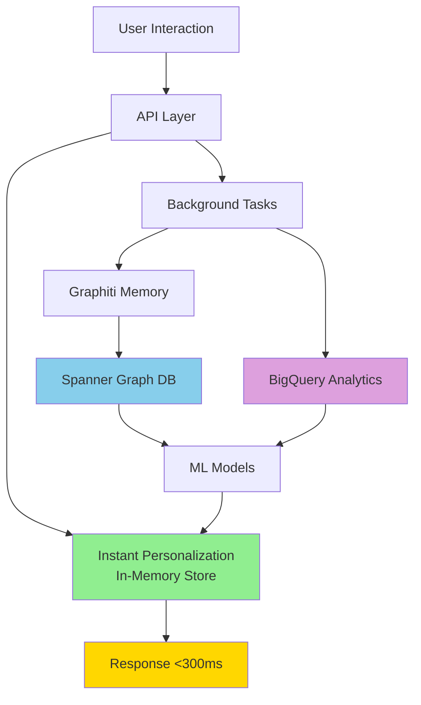

# LeafLoaf Data Flow Architecture

## System Overview



## Detailed Data Flow

### 1. Real-time Path (Green Path) - <300ms
```
User Click → API → Instant Personalization → Personalized Results
```

### 2. Memory Path (Blue Path) - Async
```
User Action → Graphiti Agent → Entity Extraction → Spanner Graph
```

### 3. Analytics Path (Purple Path) - Async
```
User Event → BigQuery Streaming → Analytics Tables → ML Features
```

## Data Storage Layers

### 🟢 Layer 1: Instant Personalization (In-Memory)
**Purpose**: Immediate personalization with zero latency
**Update Time**: <10ms
**Data Stored**:
```python
{
    "user_123": {
        "categories": {"Dairy": 0.8, "Organic": 0.6},
        "brands": {"Organic Valley": 0.7},
        "products": {"milk": 0.9},
        "last_updated": "2025-06-28T10:30:00Z"
    }
}
```

### 🔵 Layer 2: Graphiti/Spanner (Graph Memory)
**Purpose**: Relationship-based memory and patterns
**Update Time**: ~100ms
**Data Stored**:

#### Entities
```json
{
    "entity_id": "user:demo_123",
    "entity_type": "user",
    "attributes": {
        "preferences": {
            "dietary": ["organic", "gluten-free"],
            "categories": ["dairy", "produce"],
            "price_sensitivity": "medium"
        },
        "household": {
            "size": 4,
            "has_children": true
        }
    }
}
```

#### Relationships
```json
{
    "source": "user:demo_123",
    "target": "product:milk_organic",
    "relationship": "frequently_buys",
    "properties": {
        "frequency": "weekly",
        "quantity": 2,
        "last_purchase": "2025-06-21"
    }
}
```

#### Temporal Patterns
```json
{
    "user": "demo_123",
    "pattern": "reorder_cycle",
    "product": "milk",
    "cycle_days": 7,
    "confidence": 0.85,
    "next_expected": "2025-06-28"
}
```

### 🟣 Layer 3: BigQuery (Analytics Warehouse)
**Purpose**: Historical analytics and ML training
**Update Time**: ~200ms (streaming)
**Data Stored**:

#### Event Stream
```sql
-- Real-time event capture
user_search_events:
- event_id, user_id, session_id, query, results, timestamp

product_interaction_events:
- event_id, user_id, product_id, signal_type, weight, timestamp

cart_events:
- event_id, user_id, product_id, action, quantity, timestamp

order_events:
- order_id, user_id, products[], total, timestamp
```

#### Aggregated Views
```sql
-- Hourly/Daily rollups
user_category_preferences:
- user_id, category, interaction_count, avg_weight, last_30d_score

product_popularity:
- product_id, views, clicks, adds_to_cart, purchases, conversion_rate

user_cohorts:
- cohort_id, user_count, common_categories, avg_basket_size
```

## Signal Processing

### Signal Weights and Decay

| Signal Type | Initial Weight | Decay Factor | Memory Duration |
|------------|---------------|--------------|-----------------|
| View | 0.1 | 0.98/day | 30 days |
| Click | 0.2 | 0.95/day | 60 days |
| Add to Cart | 0.5 | 0.90/day | 90 days |
| Purchase | 1.0 | 0.85/day | 180 days |

### Personalization Score Calculation

```python
def calculate_preference_score(interactions):
    score = 0
    now = datetime.now()
    
    for interaction in interactions:
        age_days = (now - interaction.timestamp).days
        weight = SIGNAL_WEIGHTS[interaction.type]
        decay = DECAY_FACTORS[interaction.type] ** age_days
        
        score += weight * decay
    
    return min(1.0, score)  # Cap at 1.0
```

## Privacy and Control

### User Data Controls
```json
{
    "user_id": "demo_123",
    "privacy_settings": {
        "personalization_enabled": true,
        "data_retention_days": 90,
        "features": {
            "search_history": true,
            "purchase_history": true,
            "price_tracking": false,
            "household_inference": false
        }
    }
}
```

### Data Deletion Flow
1. User requests deletion
2. Immediate removal from in-memory store
3. Mark for deletion in Graphiti/Spanner
4. Queue BigQuery deletion job
5. Complete within 72 hours

## Performance Characteristics

| Component | Latency | Throughput | Storage |
|-----------|---------|------------|---------|
| Instant Personalization | <10ms | 100K req/s | 100MB RAM |
| Graphiti/Spanner | ~100ms | 10K writes/s | Unlimited |
| BigQuery Streaming | ~200ms | 100K events/s | Unlimited |
| Total User Response | <300ms | - | - |

## Monitoring and Observability

### Key Metrics
- **P50/P95/P99 Latency**: Track response times
- **Personalization Hit Rate**: % requests with personalization
- **Signal Processing Lag**: Time from event to personalization
- **Memory Efficiency**: RAM usage per user

### Alerts
- Response time > 350ms
- Personalization hit rate < 80%
- Spanner write latency > 200ms
- BigQuery streaming errors > 1%

## Future Enhancements

1. **Edge Personalization**: Deploy to CDN edge nodes
2. **Real-time ML**: Online learning from streams
3. **Cross-session Memory**: Share patterns across devices
4. **Predictive Prefetch**: Anticipate user needs
5. **Privacy-preserving ML**: Federated learning