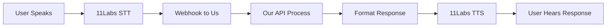

# 11Labs Voice Integration - Complete Flow

## 🎯 Overview

This document shows the complete integration with 11Labs for voice conversations, from raw audio to our conversational API and back to speech.

---

## 🔊 11Labs Webhook Flow

### 1. User Speaks to 11Labs Agent

User says: *"Hey can you get me some rice I need about 20 pounds for my restaurant"*

### 2. 11Labs Sends Webhook to Our Server

```json
POST /api/v1/voice/webhook
Content-Type: application/json
X-11Labs-Signature: hmac_sha256_signature

{
  "type": "user_message",
  "conversation_id": "conv_abc123",
  "agent_id": "agent_leafloaf_001",
  "timestamp": "2025-06-26T14:30:00Z",
  
  "user_input": {
    "text": "hey can you get me some rice I need about 20 pounds for my restaurant",
    "audio": {
      "url": "https://11labs.io/audio/conv_abc123/turn_1.mp3",
      "duration_ms": 4200,
      "format": "mp3"
    },
    "transcription": {
      "text": "hey can you get me some rice I need about 20 pounds for my restaurant",
      "confidence": 0.94,
      "language": "en-US",
      "words": [
        {"word": "hey", "start": 0.0, "end": 0.3, "confidence": 0.98},
        {"word": "can", "start": 0.4, "end": 0.6, "confidence": 0.95},
        // ... more word timings
      ]
    }
  },
  
  "conversation_state": {
    "turn_count": 1,
    "session_start": "2025-06-26T14:29:45Z",
    "user_metadata": {
      "phone_number": "+1234567890",
      "caller_id": "user_123",
      "location": "New York, NY"
    }
  },
  
  "agent_context": {
    "voice_id": "rachel",
    "language": "en-US",
    "temperature": 0.7,
    "response_format": "text"  // We provide text, 11Labs synthesizes
  }
}
```

### 3. Our Webhook Handler Processes

```python
# src/api/voice_webhook.py

@app.post("/api/v1/voice/webhook")
async def handle_11labs_webhook(
    request: Request,
    background_tasks: BackgroundTasks
):
    # Verify webhook signature
    if not verify_11labs_signature(request):
        raise HTTPException(401, "Invalid signature")
    
    body = await request.json()
    
    # Extract conversation ID and map to our session
    conversation_id = body["conversation_id"]
    session_id = get_or_create_session(conversation_id)
    
    # Map 11Labs caller to our user
    user_id = await map_caller_to_user(
        phone=body["conversation_state"]["user_metadata"]["phone_number"],
        caller_id=body["conversation_state"]["user_metadata"]["caller_id"]
    )
    
    # Build our API request
    api_request = {
        "input_type": "voice",
        "text": body["user_input"]["text"],
        "voice_metadata": {
            "duration": body["user_input"]["audio"]["duration_ms"] / 1000,
            "confidence": body["user_input"]["transcription"]["confidence"],
            "language": body["user_input"]["transcription"]["language"],
            "source": "11labs",
            "word_timings": body["user_input"]["transcription"]["words"]
        },
        "user_id": user_id,
        "session_id": session_id,
        "context": {
            "user_type": await get_user_type(user_id),
            "voice_platform": "11labs",
            "conversation_turn": body["conversation_state"]["turn_count"]
        }
    }
    
    # Process through our conversational API
    response = await process_voice_request(api_request)
    
    # Format response for 11Labs
    return format_11labs_response(response, body["agent_context"])
```

### 4. Process Through Our Conversational API

```python
async def process_voice_request(api_request):
    # This is our standard flow
    result = await analyze_endpoint.process_request(api_request)
    
    # Add voice-specific handling
    if result["data"]["conversation"]["state"] == "awaiting_selection":
        # Add voice-friendly options
        result["voice_options"] = create_voice_menu(
            result["data"]["conversation"]["options"]
        )
    
    return result
```

### 5. Format Response for 11Labs

```python
def format_11labs_response(our_response, agent_context):
    """Convert our response to 11Labs format"""
    
    conversation_data = our_response["data"]["conversation"]
    
    # Build natural voice response
    voice_text = build_voice_text(conversation_data)
    
    # Add voice-specific instructions
    voice_instructions = get_voice_instructions(conversation_data["state"])
    
    return {
        "response": {
            "text": voice_text,
            "voice_instructions": voice_instructions,
            "ssml": convert_to_ssml(voice_text)  # Optional SSML markup
        },
        
        "conversation_update": {
            "state": conversation_data["state"],
            "context": conversation_data.get("context", {}),
            "expecting_response": conversation_data.get("options") is not None
        },
        
        "suggested_actions": format_voice_actions(
            conversation_data.get("options", [])
        ),
        
        "metadata": {
            "processing_time_ms": our_response["meta"]["performance"]["total_ms"],
            "items_found": len(our_response["data"].get("extracted_items", [])),
            "requires_clarification": conversation_data["state"] == "clarification_needed"
        }
    }
```

### 6. 11Labs Response to User

```json
{
  "response": {
    "text": "I found Laxmi Basmati Rice in 20 pound bags for $35, which matches your request perfectly. You usually order 2 bags. Would you like your regular 2 bags, or just 1 bag this time?",
    
    "voice_instructions": {
      "pace": "moderate",
      "emphasis": ["Laxmi Basmati Rice", "20 pound bags", "$35"],
      "pause_after": true,
      "expected_response_type": "selection"
    },
    
    "ssml": "<speak>I found <emphasis>Laxmi Basmati Rice</emphasis> in <emphasis>20 pound bags</emphasis> for <say-as interpret-as='currency'>$35</say-as>, which matches your request perfectly. <break time='300ms'/> You usually order 2 bags. Would you like your regular 2 bags, or just 1 bag this time?</speak>"
  },
  
  "conversation_update": {
    "state": "awaiting_selection",
    "context": {
      "pending_item": "rice",
      "selection_options": ["2 bags", "1 bag", "different"]
    },
    "expecting_response": true
  },
  
  "suggested_actions": [
    {"id": "regular", "spoken": "two bags", "aliases": ["regular", "usual", "two"]},
    {"id": "single", "spoken": "one bag", "aliases": ["one", "single", "just one"]},
    {"id": "different", "spoken": "show other options", "aliases": ["different", "other", "more"]}
  ]
}
```

---

## 🔄 Complete Multi-Turn Flow

### Turn 1: Initial Request


### Turn 2: User Responds
User says: *"Yeah give me the regular 2 bags"*

11Labs webhook:
```json
{
  "type": "user_message",
  "conversation_id": "conv_abc123",
  "user_input": {
    "text": "yeah give me the regular 2 bags"
  },
  "conversation_state": {
    "turn_count": 2,
    "previous_state": "awaiting_selection",
    "context": {
      "pending_item": "rice",
      "selection_options": ["2 bags", "1 bag", "different"]
    }
  }
}
```

Our handler:
```python
# Detect this is a continuation
if body["conversation_state"].get("previous_state") == "awaiting_selection":
    # Add context about what we're waiting for
    api_request["conversation_context"] = {
        "previous_turn": body["conversation_state"]["turn_count"] - 1,
        "previous_state": body["conversation_state"]["previous_state"],
        "pending_selection": body["conversation_state"]["context"]
    }
```

---

## 🎙️ Voice-Specific Features

### 1. Natural Language Variations
```python
VOICE_VARIATIONS = {
    "confirmation": [
        "yeah", "yes", "yep", "sure", "okay", "sounds good",
        "that's right", "correct", "go ahead"
    ],
    "quantity_two": [
        "two", "2", "couple", "pair", "both", "regular", "usual"
    ],
    "more_items": [
        "I also need", "and", "plus", "oh and", "also get me",
        "I forgot", "wait also"
    ]
}
```

### 2. Voice-Optimized Responses
```python
def build_voice_text(conversation_data):
    """Build natural voice responses"""
    
    state = conversation_data["state"]
    
    if state == "awaiting_selection":
        # Short, clear options
        return format_voice_selection(conversation_data)
    
    elif state == "clarification_needed":
        # Gentle clarification
        return format_voice_clarification(conversation_data)
    
    elif state == "cart_updated_complete":
        # Celebratory confirmation
        return format_voice_confirmation(conversation_data)
```

### 3. Interruption Handling
```json
{
  "type": "user_interruption",
  "conversation_id": "conv_abc123",
  "interruption_point": {
    "timestamp": 2.3,
    "partial_text": "wait actually..."
  },
  "agent_state": {
    "was_speaking": true,
    "interrupted_text": "I found Laxmi Basmati Rice in 20 pound..."
  }
}
```

---

## 🔧 Implementation Details

### 1. Session Mapping
```python
# Map 11Labs conversation to our session
async def get_or_create_session(conversation_id: str) -> str:
    # Check Redis for existing mapping
    session_id = await redis.get(f"11labs:session:{conversation_id}")
    
    if not session_id:
        # Create new session
        session_id = f"voice_session_{uuid.uuid4().hex[:8]}"
        await redis.setex(
            f"11labs:session:{conversation_id}",
            3600,  # 1 hour TTL
            session_id
        )
    
    return session_id
```

### 2. User Identification
```python
async def map_caller_to_user(phone: str, caller_id: str) -> str:
    # Try phone number first
    user = await db.get_user_by_phone(phone)
    
    if not user:
        # Check caller ID
        user = await db.get_user_by_caller_id(caller_id)
    
    if not user:
        # Create guest user
        user = await create_guest_user(phone, caller_id)
    
    return user.id
```

### 3. Voice Menu Builder
```python
def create_voice_menu(options):
    """Create voice-friendly menu options"""
    
    voice_menu = []
    for i, option in enumerate(options):
        voice_option = {
            "number": i + 1,
            "text": option["text"],
            "spoken_aliases": get_spoken_aliases(option),
            "dtmf": str(i + 1)  # Phone keypad option
        }
        voice_menu.append(voice_option)
    
    return voice_menu
```

---

## 📊 Analytics Integration

### Voice-Specific Events
```json
{
  "event_type": "voice_conversation_turn",
  "platform": "11labs",
  "conversation_id": "conv_abc123",
  "session_id": "voice_session_789",
  "user_id": "user123",
  "turn": 2,
  "metrics": {
    "speech_duration_ms": 2100,
    "transcription_confidence": 0.95,
    "response_generation_ms": 380,
    "total_latency_ms": 580,
    "interruption": false,
    "clarification_needed": false
  }
}
```

---

## 🚀 Deployment Configuration

### Environment Variables
```yaml
ELEVENLABS_API_KEY: "sk_1a5..."
ELEVENLABS_AGENT_ID: "agent_leafloaf_001"
ELEVENLABS_WEBHOOK_SECRET: "whsec_..."
ELEVENLABS_VOICE_ID: "rachel"
ELEVENLABS_WEBHOOK_URL: "https://api.leafloaf.com/api/v1/voice/webhook"
```

### 11Labs Agent Configuration
```json
{
  "agent": {
    "name": "LeafLoaf Shopping Assistant",
    "voice_id": "rachel",
    "first_message": "Hi! I'm here to help with your grocery order. What can I get for you today?",
    "system_prompt": "You are a helpful grocery shopping assistant. Keep responses concise and natural.",
    "webhook_url": "https://api.leafloaf.com/api/v1/voice/webhook",
    "response_timeout_ms": 2000,
    "interruption_threshold": 0.6
  }
}
```

This complete integration shows how voice flows from 11Labs through our system and back, maintaining conversation context throughout!