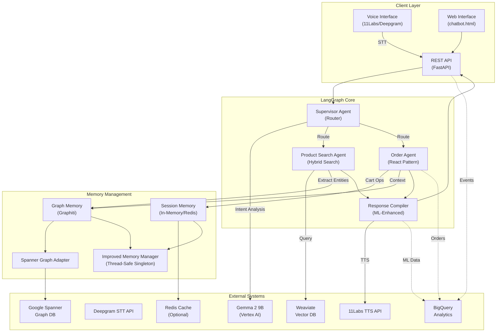

# LeafLoaf LangGraph Architecture Diagram

## System Overview



## Component Details

### 1. Client Layer
- **Voice Interface**: 11Labs for TTS, Deepgram for STT
- **Web Interface**: Simple HTML/JS for testing
- **REST API**: FastAPI with async support

### 2. LangGraph Core (Multi-Agent System)
- **Supervisor**: LLM-powered router with parallel execution capability
- **Product Search**: Hybrid search (semantic + keyword) with dynamic alpha
- **Order Agent**: React pattern with tools (add/remove/update/confirm)
- **Response Compiler**: Merges results with ML recommendations

### 3. Memory Management
- **Improved Memory Manager**: Thread-safe singleton with dependency injection
- **Session Memory**: Conversation history and cart state
- **Graph Memory**: Entity extraction and relationship tracking
- **Spanner Adapter**: Bridge between Graphiti interface and Spanner

### 4. External Integrations
- **Gemma 2 9B**: Primary LLM (moving to Vertex AI)
- **Weaviate**: Vector search for products
- **Spanner**: Graph database for user patterns
- **BigQuery**: Real-time analytics and ML features
- **Redis**: Optional session cache

## Data Flow Patterns

### 1. Conversational Flow
```
User Voice → Deepgram STT → API → Supervisor → Agents → Memory → Response → 11Labs TTS → User
```

### 2. Search Flow
```
Query → Supervisor → Product Search → Weaviate (Hybrid) → Graphiti (Entities) → Response Compiler
```

### 3. Order Flow
```
Cart Operation → Order Agent → Session Memory → Spanner (Patterns) → BigQuery (Analytics)
```

### 4. Memory Flow
```
Message → Entity Extraction → Graph Memory → Spanner → Pattern Detection → Context Retrieval
```

## Key Design Decisions

1. **LangGraph over LangChain**: Better agent orchestration
2. **Spanner over Neo4j**: Native GCP integration, better scaling
3. **Hybrid Search**: Balances semantic understanding with exact matches
4. **Thread-Safe Singleton**: Prevents memory leaks, enables testing
5. **Event Streaming**: Real-time BigQuery analytics without latency impact
6. **Rule-Based ML**: No LLM overhead for recommendations
7. **Voice-First**: Natural conversation patterns drive the design

## Performance Targets

- **Total Latency**: <300ms
- **Search**: <100ms (with Weaviate)
- **LLM**: <200ms (with cached auth)
- **Memory Ops**: <50ms
- **Voice**: <150ms round-trip

## Scaling Considerations

1. **Horizontal Scaling**: Stateless API, shared memory via Redis
2. **Graph Partitioning**: User-based sharding in Spanner
3. **Cache Strategy**: Redis for hot data, Spanner for cold
4. **Async Everything**: Non-blocking I/O throughout
5. **Connection Pooling**: Reuse expensive connections