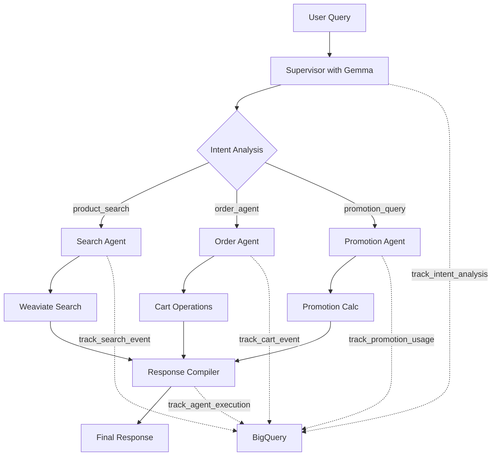

# BigQuery Flow Tracking Architecture

## Complete Flow: Gemma → Search → Promotions → Cart



## Event Tracking Details

### 1. Intent Analysis (Gemma)
```json
{
  "event_type": "intent_analysis",
  "properties": {
    "query": "add 3 organic milk to cart",
    "intent": "add_to_order",
    "confidence": 0.95,
    "alpha": 0.5,
    "routing_decision": "order_agent",
    "gemma_latency_ms": 145,
    "enhanced_query": "add 3 organic milk to cart",
    "entities": ["organic milk"],
    "attributes": ["organic"]
  }
}
```

### 2. Search Event
```json
{
  "search_id": "uuid",
  "query": "organic milk",
  "alpha_value": 0.5,
  "results_count": 8,
  "search_type": "hybrid",
  "response_time_ms": 287,
  "clicked_results": ["OV_MILK_WH", "HO_MILK_ORG"]
}
```

### 3. Cart Event with Promotions
```json
{
  "event_type": "add",
  "product_sku": "OV_MILK_WH",
  "product_name": "Organic Whole Milk",
  "quantity": 3,
  "price": 6.99,
  "cart_total_after": 20.97,
  "promotions_applied": ["Organic 10% Off", "BOGO Dairy"],
  "discount_total": 10.09,
  "savings_percentage": 31.6
}
```

### 4. Complete Flow Event
```json
{
  "event_type": "agent_flow_complete",
  "properties": {
    "query": "add 3 organic milk to cart",
    "intent": "add_to_order",
    "routing_decision": "order_agent",
    "agents_executed": ["supervisor", "order_agent", "promotion_agent", "response_compiler"],
    "total_latency_ms": 324,
    "agent_timings": {
      "supervisor": 145,
      "order_agent": 87,
      "promotion_agent": 32,
      "response_compiler": 60
    },
    "search_results_count": 0,
    "has_promotions": true,
    "cart_discount": 10.09
  }
}
```

## BigQuery Tables Structure

### Core Event Tables
1. **analytics.user_events** - All events with JSON properties
2. **analytics.search_events** - Dedicated search tracking
3. **analytics.cart_events** - Cart modifications
4. **analytics.order_events** - Completed orders
5. **promotions.promotion_usage** - Promotion applications

### Key Features
- **Parallel Agent Tracking**: Multiple agents run concurrently, all tracked
- **Gemma Intent Capture**: Every LLM call tracked with latency
- **Alpha Value Tracking**: Search strategy (keyword vs semantic) recorded
- **Promotion Attribution**: Which promotions applied to which items
- **Complete Flow Timing**: End-to-end latency with agent breakdown

### Sample Queries

#### Flow Analysis
```sql
-- Complete user journey
SELECT 
    u1.event_timestamp as query_time,
    JSON_EXTRACT_SCALAR(u1.event_properties, '$.query') as query,
    JSON_EXTRACT_SCALAR(u1.event_properties, '$.intent') as intent,
    s.results_count as products_found,
    c.product_name as cart_item,
    c.cart_total_after,
    JSON_EXTRACT_SCALAR(u2.event_properties, '$.cart_discount') as discount
FROM `analytics.user_events` u1
LEFT JOIN `analytics.search_events` s 
    ON u1.session_id = s.session_id
LEFT JOIN `analytics.cart_events` c 
    ON u1.session_id = c.session_id
LEFT JOIN `analytics.user_events` u2 
    ON u1.session_id = u2.session_id 
    AND u2.event_type = 'cart_promotions_calculated'
WHERE u1.event_type = 'intent_analysis'
ORDER BY u1.event_timestamp DESC
```

#### Performance Monitoring
```sql
-- Agent performance breakdown
SELECT 
    DATE(event_timestamp) as date,
    AVG(CAST(JSON_EXTRACT_SCALAR(event_properties, '$.gemma_latency_ms') AS FLOAT64)) as avg_gemma_ms,
    AVG(CAST(JSON_EXTRACT_SCALAR(event_properties, '$.agent_timings.product_search') AS FLOAT64)) as avg_search_ms,
    AVG(CAST(JSON_EXTRACT_SCALAR(event_properties, '$.agent_timings.promotion_agent') AS FLOAT64)) as avg_promo_ms,
    AVG(CAST(JSON_EXTRACT_SCALAR(event_properties, '$.total_latency_ms') AS FLOAT64)) as avg_total_ms
FROM `analytics.user_events`
WHERE event_type = 'agent_flow_complete'
GROUP BY date
ORDER BY date DESC
```